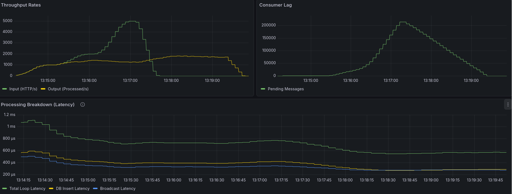

# A distributed redpanda scylladb chat app

To run the app run (add `--build` if the Rust code has changed):

```bash
docker compose up -d
```

1. Alice sends "hi" to Bob

- Make a `POST` request to `/chats/{chatId}/messages`
- Publish message to a RedPanda topic
- Do not save in the database yet

2. Background process watches the messages topic

- Save to database
- Send to Bob's Websocket if he is connected

3. Message reception

- If Bob is online
  - Push the message to Bob's Websocket
- If Bob is offline
  - It is simply stored in the database
- Upon Bob connection his client will establish a connection via `/ws/connect/{userId}` and `GET` `/chats/{chatID}/messages` to fetch the conversation.

## Evaluating the app performance


To vizualize the stress test we have 3 pannels

### Throughput Rate

- Input : Number of messages posted (HTTP req/s)
- Output : Number of message consumed by the redpanda topic (msg/s)

### Lag

- Pending messages : Number of messages waiting to be processed inside the topic (msg/s)

### Processing Breakdown (Latency)

- DB Insert Latency : Time spent inserting a message in the database (s)
- Broadcast Latency : Time spent, getting the users recipient of the message and sending the message on a tokio channel for websocket to use (s)
- Total Loop Latency : Full time spent inside the processing message loop (s)

We have submitted the backend to a load test using [K6](https://k6.io/). The test is very simple, it creates ten users that spam messages on a single chatroom.

The test start with 1 000 msg/s and goes up to 10 000 msg/s.

At 1050 msg/s the Input goes above the Output. We see up to 437 000 messages waiting to be processed inside the topic. 

Finaly we have DB latency + Brodcast Latency roughly equal to the Total Loop Latency.
This is where we are going to focus our optimization.




## Run the test

```bash
docker run --rm -i \
  --network host \
  grafana/k6 run - < tests/test-k6.ts
```

And visit `localhost:3000` with credentials admin/admin.
