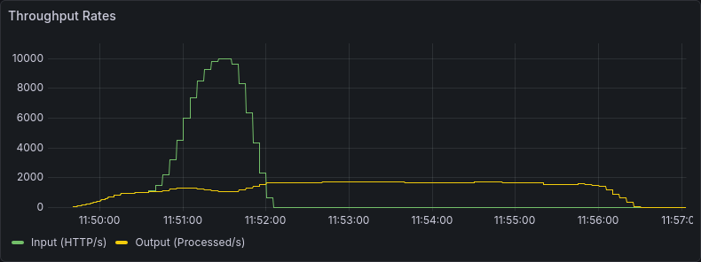
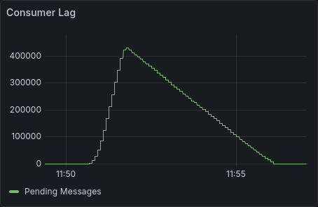
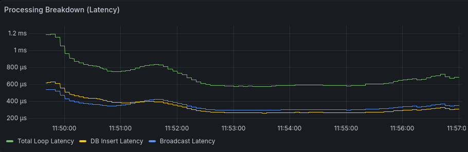
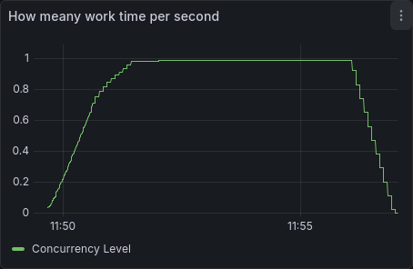
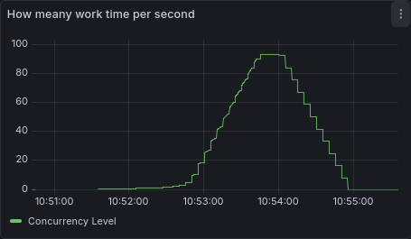
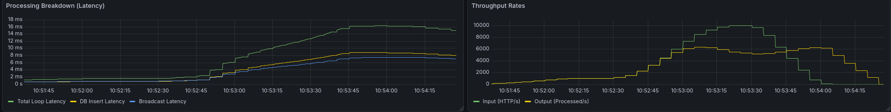
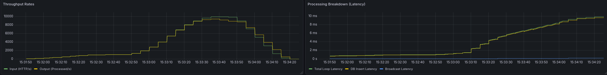

# A distributed redpanda scylladb chat app

This program is a distributed chat-app using redpanda to consume message to be sent over websocket and inserted in the nosql database ScyllaDb.

To run the app run (add `--build` if the Rust code has changed):

```bash
docker compose up -d
```

1. Alice sends "hi" to Bob

- Make a `POST` request to `/chats/{chatId}/messages`
- Publish message to a RedPanda topic
- Do not save in the database yet

2. Background process watches the messages topic

- Save to database
- Send to Bob's Websocket if he is connected

3. Message reception

- If Bob is online
  - Push the message to Bob's Websocket
- If Bob is offline
  - It is simply stored in the database
- Upon Bob connection his client will establish a connection via `/ws/connect/{userId}` and `GET` `/chats/{chatID}/messages` to fetch the conversation.

## Evaluating the app performance

To vizualize the stress test we have 3 pannels

### Throughput Rate

- Input : Number of messages posted (HTTP req/s)
- Output : Number of message consumed by the redpanda topic (msg/s)



### Lag

- Pending messages : Number of messages waiting to be processed inside the topic (msg/s)



### Processing Breakdown (Latency)

- DB Insert Latency : Time spent inserting a message in the database (s)
- Broadcast Latency : Time spent fetching chat members and dispatching the message to connected users (s)
- Total Loop Latency : Full time spent inside the processing message loop (s)


We have submitted the backend to a load test using [K6](https://k6.io/). The test is very simple, it creates ten users that spam messages on a single chatroom.

The test start with 1 000 msg/s and goes up to 10 000 msg/s.

At 1050 msg/s the Input goes above the Output. We see up to 437 000 messages waiting to be processed inside the topic. In the lag pannel.

### Sequence vs parallel

This pannel show how "second of work" are done during one second in the consumer pannel. We see that it is always inferior to one.



The density of work is less than one because the consumer code is sequential :

1. Get a message of the stream
2. Handle it

Before the message has been handled no other messages can be processed. Only one consumer

```rust
    pub async fn consume_messages(
        db: Arc<ScyllaDb>,
        connections: ConnectionMap,
    ) -> Result<()> {
        let mut stream = self.consumer.stream();
      // This implementation is one stream after the other
        while let Some(message_result) = stream.next().await {
        // Rest of the code
      }
        Ok(())
    }
}

```

With multiple parallel consumer, we can actually compute the ideal limit with [Little's law](https://en.wikipedia.org/wiki/Little%27s_law)
Where the limit L is proportional to the message per second input lambda and the latency of consuming a message W.

L = lambda x W
which gives for lambda = 0.01 (db insert) + o(0.10) (broadcast is negligible)
and W = 10 000 message/s
L = 100

```rust
pub async fn consume_messages(
    &self,
    db: Arc<ScyllaDb>,
    connections: ConnectionMap,
) -> Result<()> {
    let stream = self.consumer.stream();
    stream.for_each_concurrent(100, |message_result| {
        async move {
      // Concurrent task
    }).await;

    Ok(())
}
```



Work time per second goes nearly 100

And while the latency went up from 0.6ms to 16ms (because we batch 100 of insert a time instead of one)
The throughput increased 3 times (2k -> 6k) !



> [!NOTE]
> We actually verified Littl's law 6 000 _16_ 10^(-3) = 96 ≈ 100

### Chat members lookup

```rust
      let members = db.get_members_of_chat(chat_id).await?;
    // Lock the connection map with RwLock for each connections in the chat
      for (user_id, sender) in connections.read().await.iter() {// Do stuff}
```

to

```rust
  let members = db.get_members_of_chat(chat_id).await?;
  let lock = connections.read().await; // Lock the map only once
```

With 11 users total it does not change much but with thousands it would.

However for each message we call `get_members_of_chat` this could be cached.

Our API do not provide a way to change the list members of a chatroom after creation, but we will act as if. So we will implement a short TTL of one second. Which means that a user would have receive his message instantly and on the worst case scenario uppon adding he would wait 1 second. We could have lowered that even more and improve performance by using kafka event.

We use a dashmap to safely acess chat_id -> members datastruct

```rust
async {
        if timestamp.elapsed() < CACHE_TTL {
            members_to_use = Some(members.clone());  }
    }
    // If we go in this then members_to_use is still None
    // If the cache expired or missed
    if members_to_use.is_none() {
        let members = db.get_members_of_chat(chat_id).await?;
        members_cache.insert(chat_id, (members.clone(), Instant::now()));
        members_to_use = Some(members);}

    if let Some(members) = members_to_use {// DO STUF}

```



The implemented cache lookup mecanism do remove the broadcast latency and improve by 3 000 processed messages per second !

### Insert message latency

Finally we want to optimise the insert message latency. For this we will use ScyllaDb batch method, to apply an list of insert instead of inserting one by one.

## Run the test

```bash
docker run --rm -i \
  --network host \
  grafana/k6 run - < tests/test-k6.ts
```

And visit `localhost:3000` with credentials admin/admin.
