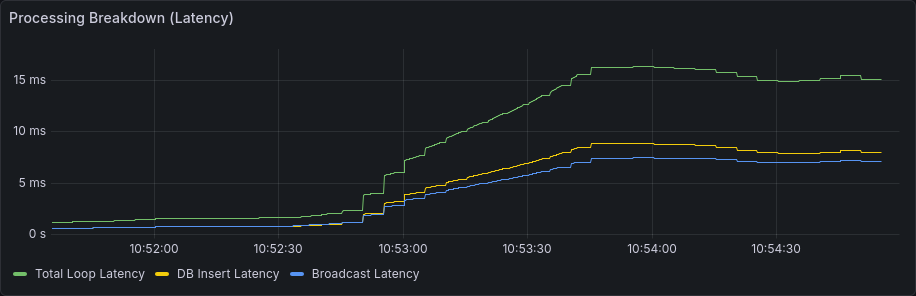
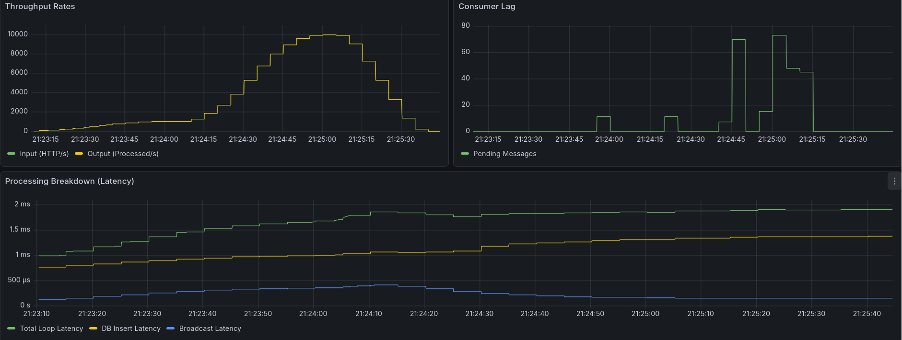

# High Performance Distributed Chat Application

A scalable backend built with Rust, Redpanda, and ScyllaDB. This project demonstrates high-throughput message processing, asynchronous concurrency, and database optimization techniques.

## Architecture

1. **Ingestion:** Messages are received via HTTP and published to a Redpanda topic.
2. **Processing:** A background consumer processes messages, batches them, and inserts them into ScyllaDB.
3. **Delivery:** Messages are pushed to connected users via WebSocket.

To run the app run (add `--build` if the Rust code has changed):

#### Running the application

```bash
docker compose up -d
```

### Flow of sending a message

1. Alice sends "hi" to Bob

- Make a `POST` request to `/chats/{chatId}/messages`
- Publish message to a Redpanda topic
- Do not save in the database yet

2. Background process, the consumer

- Watches the message topic
- Save to database
- Send to Bob's Websocket if he is connected

3. Message reception

- Bob is online: Message is pushed immediately to the WebSocket.
- Bob is offline: Message is stored in the DB, and upon reconnection the client will fetch the history of unread message.

## Performance evaluation and Optimization

To visualize the stress test we have 3 panels.

We impose the backend a load test using [K6](https://k6.io/). The test simulate 10 users spamming message in a single chatroom, starting at 1,000 msg/s and ramping up to 10,000 msg/s.

### Metrics visualized

- **Throughput Rate:** Input (HTTP req/s) vs. Output (Redpanda consumed msg/s).
- **Concurrency Level:** Number of messages waiting in the topic queue not yet consumed.
- **Latency Breakdown:** DB Insertion, Broadcast, and Total Loop Latency

### Sequential Processing

At 1,050 msg/s, the Input rate goes above the Output rate. We observed consequent consumer lag, with an all-time high of **437,000 messages** waiting to be consumed in the Redpanda topic.


#### The cause

The consumer implementation was sequential: It fetched a message, processed it (store, broadcast) and only then fetch another one. We can see this with a Concurrency Level of less than one.


```rust
    pub async fn consume_messages(
        db: Arc<ScyllaDb>,
        connections: ConnectionMap,
    ) -> Result<()> {
        let mut stream = self.consumer.stream();
      // One message after the other
        while let Some(message_result) = stream.next().await {
            // Rest of the code
        }
        Ok(())
    }
}
```

### Parallel Consumers

To remove this bottleneck, we spanned multiple thread to work concurrently on the consume task.
The ideal number can be estimated with [Little's Law](https://en.wikipedia.org/wiki/Little%27s_law) : `L = lambda x W`

- Target Throughput (lambda) = 10, 000 msg/s
- Processing Latency (W) = 0.01 s (DB INSERT)

So L, ideal number of consumer, is 100

```rust
pub async fn consume_messages(
    &self,
    db: Arc<ScyllaDb>,
    connections: ConnectionMap,
) -> Result<()> {
    let stream = self.consumer.stream();
    stream.for_each_concurrent(100, |message_result| {
        async move {
            // Concurrent task
        }
    }).await;

    Ok(())
}
```

### Result

- Throughput tripled (2k to 6k msg/s)
- Concurrency Level around 100
  > [!NOTE]
  > We actually verified Little's Law: 6,000 _16_ 10^(-3) = 96 ≈ 100
<p align="center">


</p>

### Caching and Lock Contention

Broadcast latency is still high comparable to the inserting latency. Broadcasting to websocket should be negligible against DB operation.
This is because for each message there is a database lookup to get the connected members of the group chat.



Original approach:

```rust
    // For each message a DB lookup to check connected members
    let members = db.get_members_of_chat(chat_id).await?;
    // Lock the connection map with RwLock for each connection in the chat
    for (user_id, sender) in connections.read().await.iter() {}
```

Optimized approach :

- Get the lock only once, and then look for users
- Cache the members list of groupchat with a TTL avoiding hitting the DB for every messages.

```rust
if let Some(members) = members_cache.get(&chat_id) {
    // Use cached members
} else {
    // Fetch from DB and update cache
    let members = db.get_members_of_chat(chat_id).await?;
    members_cache.insert(chat_id, (members, Instant::now()));
}
let lock = connections.read().await; // Lock once
```

#### Result

This removed the broadcast latency bottleneck and improved throughput by another 3,000 msg/s.


### Batch Inserts

To finally reach 10,000 msg/s target we had to optimized the database writes.

Instead of inserting messages one by one we used `chunks_tmeout` to divide the Redpanda stream onto group of messages that can be inserted all at once.

We have successfully handled 10,000 message/s.



We optimized the system so effectively that the k6 load generator capped before the backend **26,000 msg/s** (Output and Input overlapping).

## Run the Stress Test

```bash
docker run --rm -i \
  --network host \
  grafana/k6 run - < tests/test-k6.ts
```

And visit `localhost:3000` with credentials admin/admin.